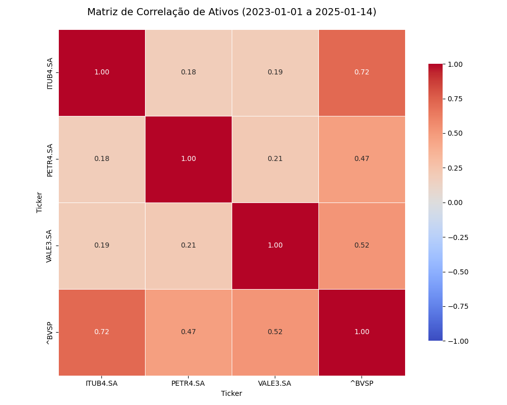
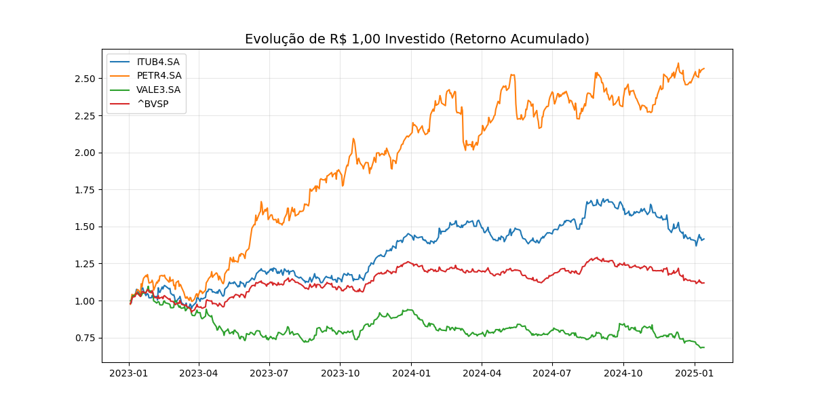

  Análise de Correlação e Performance: Blue Chips vs Ibovespa

Este projeto utiliza Python para extrair e analisar dados reais da B3 (Bolsa de Valores brasileira). O foco é entender a dinâmica entre três gigantes do mercado — **Petrobras, Vale e Itaú** — em relação ao índice de referência Ibovespa (^BVSP).

  Objetivo
O objetivo é fornecer uma visão quantitativa sobre a força da relação entre esses ativos e sua performance acumulada no período de **2023 a 2025**, auxiliando na tomada de decisão sobre diversificação e exposição ao risco sistêmico.

 Tecnologias Utilizadas
* **Python 3.13**: Linguagem base.
* **Pandas**: Limpeza e tratamento de séries temporais (uso de `.ffill()` e `.pct_change()`).
* **YFinance**: Consumo de dados financeiros em tempo real.
* **Seaborn & Matplotlib**: Visualização de dados estatísticos.

  Insights da Análise

Matriz de Correlação (Relação de Movimento)
A correlação mede o quanto os ativos se movem na mesma direção. 
* **ITUB4 (Itaú)**: Apresentou a maior correlação com o Ibovespa (0.74), sendo o ativo que melhor reflete o humor do mercado geral.
* **PETR4 (Petrobras)**: Com correlação de 0.48, mostra-se mais independente, sendo afetada por variáveis externas (Petróleo/Política) que nem sempre impactam o restante do índice.
* **Diversificação**: A baixa correlação entre **Vale e Petrobras (0.21)** sugere que uma carteira contendo ambos os ativos é mais resiliente do que uma focada em apenas um setor.



Retorno Acumulado (Performance de R$ 1,00)
Este gráfico visualiza a jornada do capital investido. Ele permite identificar não apenas quem rendeu mais, mas quem sofreu mais volatilidade (quedas bruscas) ao longo do tempo.



Como Executar
1. Clone o repositório:
   ```bash
   git clone [https://github.com/AndersonParisotto/analise-correlacao-b3.git](https://github.com/AndersonParisotto/analise-correlacao-b3.git)
2. Instale as dependências:
   `pip install pandas yfinance seaborn matplotlib`
3. Execute o script:
  `python analise_correlacao.py`
